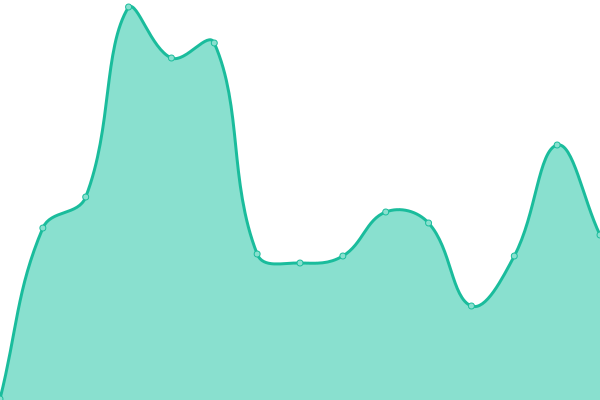
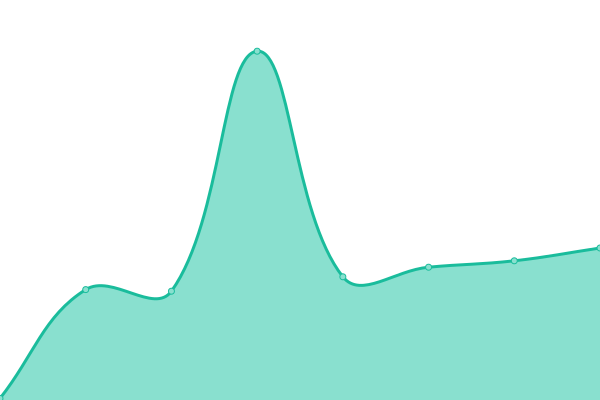
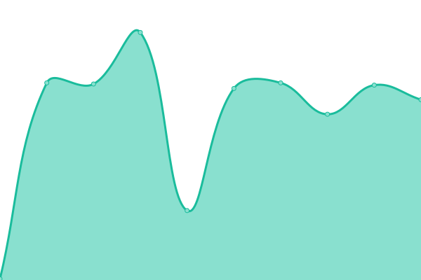

# [📈 Live Status](https://stats.anefaiz.biz.id): <!--live status--> **🟥 Complete outage**

With [Upptime](https://upptime.js.org), you can get your own unlimited and free uptime monitor and status page, powered entirely by a GitHub repository. We use [Issues](https://github.com/AneFaiz/stats/issues) as incident reports, [Actions](https://github.com/AneFaiz/stats/actions) as uptime monitors, and [Pages](https://stats.anefaiz.biz.id) for the status page.

<!--start: status pages-->
<!-- This summary is generated by Upptime (https://github.com/upptime/upptime) -->
<!-- Do not edit this manually, your changes will be overwritten -->
<!-- prettier-ignore -->
| URL | Status | History | Response Time | Uptime |
| --- | ------ | ------- | ------------- | ------ |
|  [AneFaiz Studio](https://stats.anefaiz.biz.id) | 🟥 Down | [ane-faiz-studio.yml](https://github.com/AneFaiz/stats/commits/HEAD/history/ane-faiz-studio.yml) | 

 360ms
     
 | 

<a href="https://stats.anefaiz.biz.id/history/ane-faiz-studio">99.70%</a>
    

|  Zufty Smp | 🟥 Down | [zufty-smp.yml](https://github.com/AneFaiz/stats/commits/HEAD/history/zufty-smp.yml) | 

 243ms
     
 | 

<a href="https://stats.anefaiz.biz.id/history/zufty-smp">0.15%</a>
    

|  Titas IT Solution | 🟥 Down | [titas-it-solution.yml](https://github.com/AneFaiz/stats/commits/HEAD/history/titas-it-solution.yml) | 

 103ms
     
 | 

<a href="https://stats.anefaiz.biz.id/history/titas-it-solution">0.00%</a>
    

|  Ramzi Store | 🟥 Down | [ramzi-store.yml](https://github.com/AneFaiz/stats/commits/HEAD/history/ramzi-store.yml) | 

 168ms
     
 | 

<a href="https://stats.anefaiz.biz.id/history/ramzi-store">0.00%</a>
    

<!--end: status pages-->

[**Visit our status website →**](https://stats.anefaiz.biz.id)
